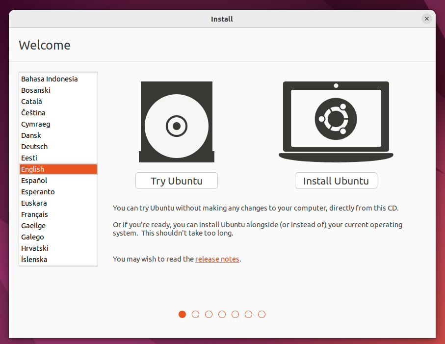

# Installing Ubuntu
{: .no_toc }

## Table of contents
{: .no_toc .text-delta }

1. TOC
{:toc}

---

## Introduction

Ubuntu is one of the most popular Linux distros there is. It is based on Debian, and it uses the APT package manager, which while simple, will allow us to access almost any software or dependency needed.

Warning
{: .label .label-red }
Maintaining a dual-boot system is tricky. Please consider installing Ubuntu as your main OS, or using the WSL compability layer on Windows. Remember to back-up your files before applying any modification to your partition table.

## Requirements

To install Ubuntu you'll need:

- Ubuntu ISO image
- A 4GB or larger USB drive
- BalenaEtcher (or Rufus)

You can get the latest release of Ubuntu at:

[Ubuntu 22.04](https://releases.ubuntu.com/22.04/ubuntu-22.04-desktop-amd64.iso){: .btn .btn-purple }

The latest version of BalenaEtcher is available at:

[BalenaEtcher](https://www.balena.io/etcher/){: .btn .btn-green }

## Creating a Bootable drive

Mounting the ISO on Balena Etcher only takes three steps:

1. Select the downloaded ISO
2. Select your USB drive
3. Flash your device

## Booting Ubuntu Live Session

Boot your computer from the bootable drive by accessing the boot menu of your computer. You can try using `F2`, `F12` or `ESC` to access the boot menu. To find the correct button, find the specific instructions according to your motherboard and BIOS.

After booting from the drive, the GRUB menu will appear. Select the first option to start the live session.

After selecting your language, start the installation clicking on `Install Ubuntu`.

Then, select the keyboard layout according to your preferences, and press `Continue`.

Select whether you want a normal installation, or a minimal installation. If you have storage limitations, use the minimal installation.

If you have an internet connection select the option to download updates while installing. Finally, check the box to install third-party software to download additional drivers.

## Installation Type

According to your preference, you may need to choose between using Ubuntu as your main OS, or installing Ubuntu alongside Windows 10. Remember to backup your files before proceeding.

### Installing Ubuntu as the main OS

If you're planning to use Ubuntu as the main OS, select the option to `Erase disk and Install Ubuntu`, and then skip to the user creation Step. This will automatically create the partition table, and **install Ubuntu as the only OS**.

### Installing Ubuntu alongside Windows

If you want to Dual-boot Ubuntu and Windows, select the option to `Install Ubuntu alongise WIndows Boot Manager`. In the following screen, you will be asked to allocate drive space for Ubuntu.

Remember to allocate at least 20 Gb (Because of the PDK, plus the OS and other needed utilities). If the installer is unable to allocate the selected space, the installation will fail. Make sure to have enough free storage.

## User Creation

Finally, select your timezone, and proceed to the user creation step. Select an user name, and appropiate password.

Press continue, and wait for a few minutes while the installation is completed.

## Complete Installation

After the installer is done, you should be able to reboot your computer, and remove the installation drive. After restarting, instead of directly booting into Windows, there will be a GRUB menu, from where we can select the OS which we want to use. For example- to get Ubuntu, select it otherwise go for Windows Boot manager for Windows OS.

## Next steps

To continue with the EDA Tools environment set-up, continue on to the EDA Tools installation guide.