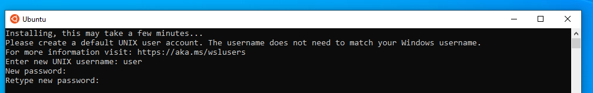

# Installing WSL 2 on Windows 11
{: .no_toc }

## Table of contents
{: .no_toc .text-delta }

1. TOC
{:toc}

---

## Introduction

The Windows subsytem for Linux (WSL) is a compability layer that enables you to use Linux tools without the need to dual-boot. On Windows 10, a 3rd party tool is needed to use graphical applications.

## Requirements

You must be running **Windows 10 version 2004** (**Build 19041**) or **Higher**. It is highly recommended to run **Windows Update** before starting this guide.

<div class="code-example" markdown="1">
Tip: To check your windows version press `Windows Key + R`, type `winver` and press `Enter`.

</div>

## Installing WSL + Ubuntu

After making sure you are on the correct version of Windows, simply run **PowerShell as administrator** 


Then run the following command:

```powershell
wsl --install
```
This command will enable the required components, download the Linux kernel, and install **Ubuntu**.


Once that windows has restarted, Ubuntu should start automatically with the message: `Installing, this may take a few minutes...`, If not, it should be available on the start menu.


After a few minutes, a prompt will ask for a user name and a password. This user and password are exclusive for Ubuntu, and are not related to the Windows ones.




## Ubuntu first run & Updating packages

Following the user credentials set-up, a message should indicate that the list of updates is older than a week. To update the pre-installed packages run:

```bash
sudo apt update && sudo apt upgrade
```
After entering your password, the installed packages will be upgraded to their latest stable release. This process can take up to 10 minutes or more depending on the internet connecction. It is a good practice to update pre-installed packages to avoid further problems down the road.

## Installing the GUI support

Since WSL 2 on Windows 10 has no support for graphical apps, is necessary to install a Xserver to run applications such as Magic. To simplify this process  we'll use `GWSL`, from Opticos Studios.

[GWSL on Github](https://opticos.github.io/gwsl/){: .btn .btn-green }

To install it, just look for **GWSL** on the Microsoft Store.


After installing, **grant firewall access to GWSL**. This is the only extra configuration needed, and therefore the most important.


If set up correctly, you should be able to run graphical apps on Ubuntu, which are completely integrated with the windows desktop.


## Next steps

To continue with the EDA Tools environment set-up, continue on to the EDA Tools installation guide.

