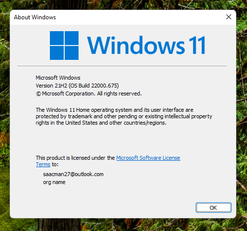
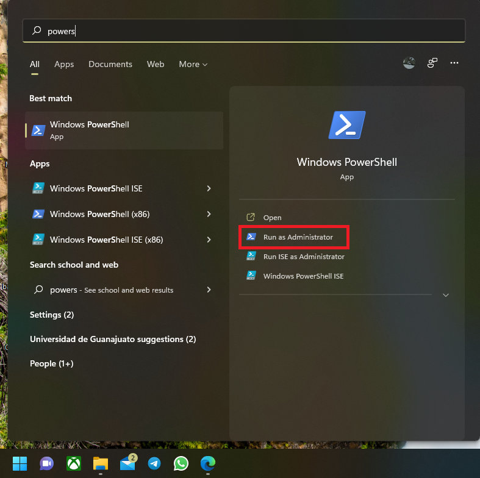
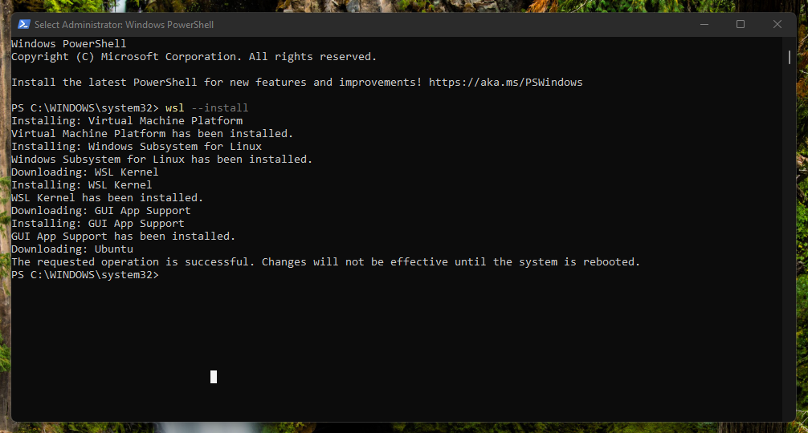
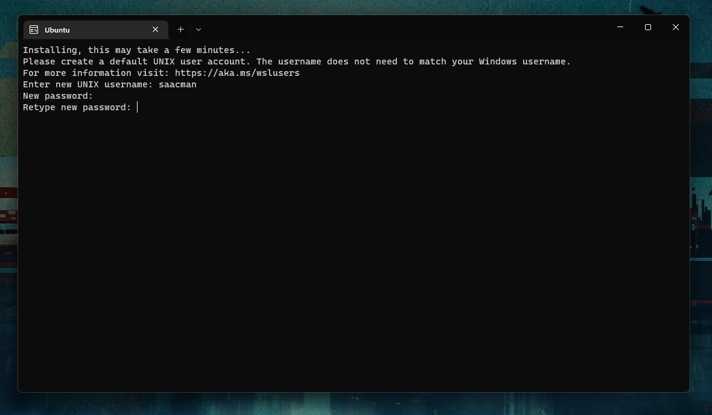
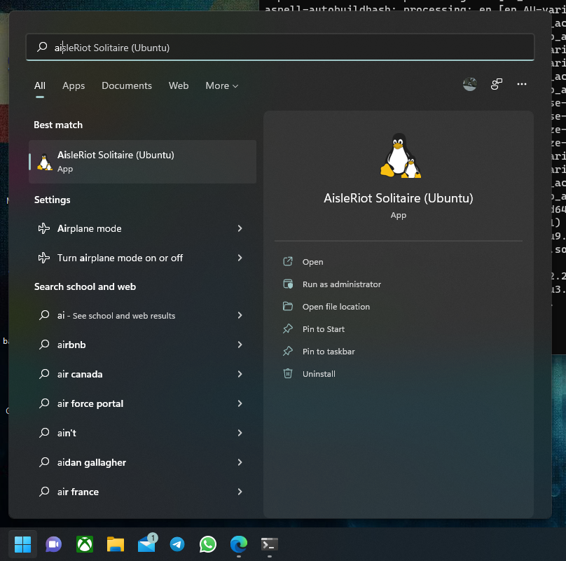
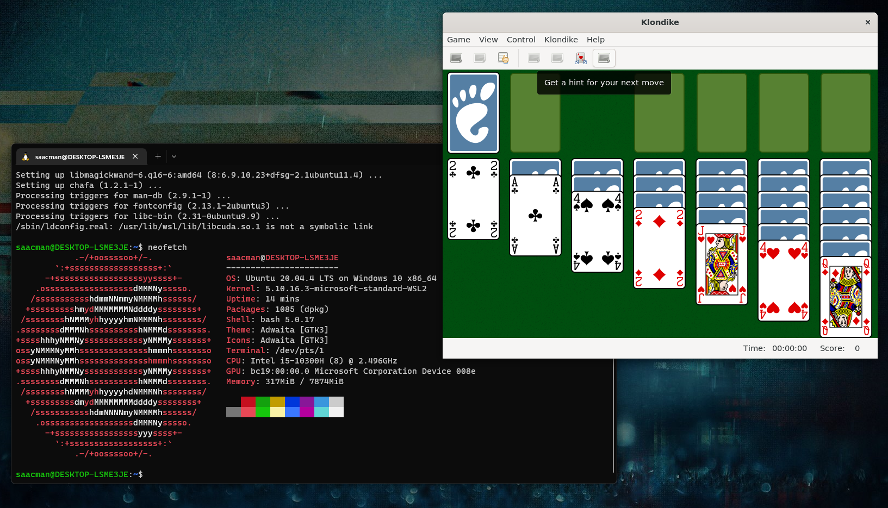

# Installing WSL 2 on Windows 11
{: .no_toc }

## Table of contents
{: .no_toc .text-delta }

1. TOC
{:toc}

---

## Introduction

WSL (Windows Subsytem for Linux) is a compatibility layer that enables you to use Linux tools without the need to dual-boot. The latest version of WSL 2 on Windows 11 includes native support for graphic apps, which simplifies the work flow integration.

## Requirements

If you are using Windows 11, no extra requirements are needed. Just in case, is recommended to run Windows Update before continuing with this guide. The version of windows used was 21H2 Build 22000.675.



## Installation

Using the start menu, search for PowerShell and select `Run as administrator`.


Then run the following command:

```powershell
wsl --install
```

This command will enable the required components, download the Linux kernel, and install **Ubuntu**.



After restart, the Windows terminal should start automatically with the message: `Installing, this may take a few minutes...`.

After a few minutes, a prompt will ask for a username and a password. This user and password are exclusive for Ubuntu, and are not related to the Windows ones.




## Ubuntu first run & Updating packages

Following the user credentials set-up, a message should indicate that the list of updates is older than a week. To update the pre-installed packages run:

```bash
sudo apt update && sudo apt upgrade
```
After entering your password, the installed packages will be upgraded to their latest stable release. This process can take up to 10 minutes or more depending on the internet connection. It is a good practice to update pre-installed packages to avoid further problems down the road.

## Using the GUI

Windows 11 uses WSLg to enable support for running GUI apps on Windows in a fully integrated desktop experience. For example, we can install AisleRiot using the command:

```bash
sudo apt install aisleriot
```

Once the installation is done, AisleRiot will be available on the Windows start menu.



Any Ubuntu app should be available on the start menu



## Next steps

To continue with the EDA Tools environment set-up, continue on to the EDA Tools installation guide.
