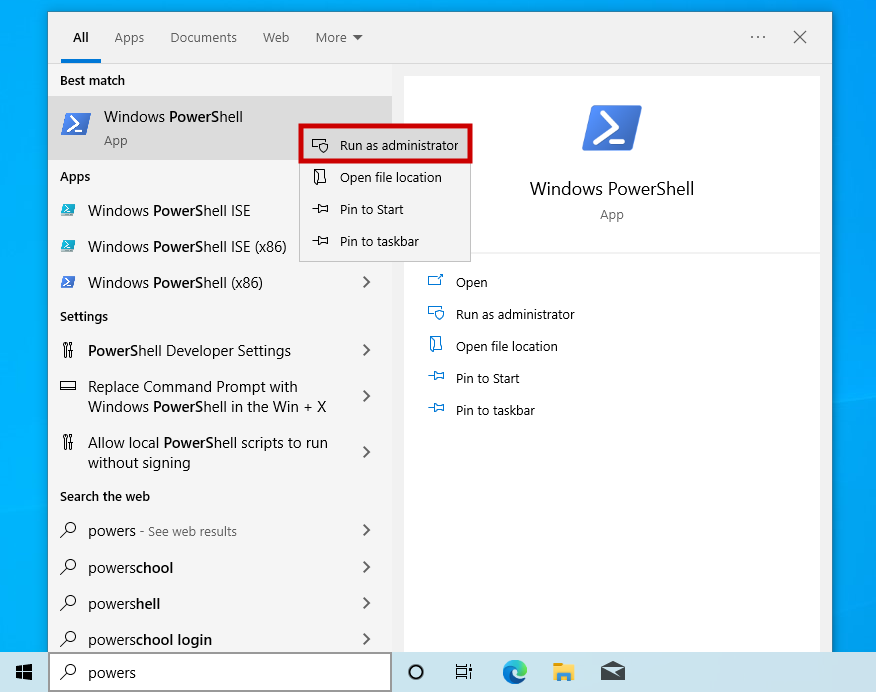

# Installing WSL 2 on Windows 11
{: .no_toc }

## Table of contents
{: .no_toc .text-delta }

1. TOC
{:toc}

---

## Introduction

WSL (Windows subsytem for linux) is a compability layer that enables you to use Linux tools without the need to dual-boot. The latest version of WSL 2 on windows 11 includes native support for graphic apps, which simplifies the work flow integration.

## Requirements

If you are using windows 11, no extra requirements are needed.

## Installation

Simply run **PowerShell as administrator** 



Then run the following command:

```powershell
wsl --install
```

## Using the GUI